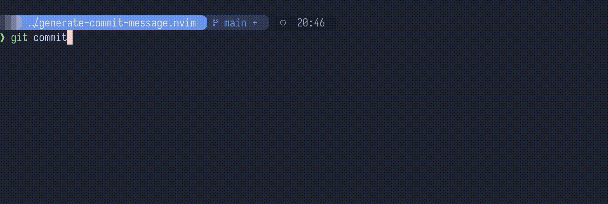

# generate-commit-message.nvim

[](https://opensource.org/licenses/MIT)

Generate git commit messages using Ollama's local or cloud LLMs.



## Features

- Generates conventional commit messages from staged diffs
- Runs via Ollama, self-hosted for privacy or cloud for speed
- Processes multiple files in parallel
- Auto-triggers when opening an empty commit buffer (optional)
- Inserts the message directly into the commit buffer

## Requirements

- Neovim >= 0.10
- [Ollama](https://ollama.com/) — local (Linux/macOS) or cloud API
- `curl` installed (ships with most systems)
- At least one Ollama model (e.g. `gemma4`)

## Installation

### Neovim 0.12+ (built-in packages)

```lua
vim.pack.add({
  "https://github.com/martinhjartmyr/generate-commit-message.nvim",
})
```

### lazy.nvim

```lua
{
  "martinhjartmyr/generate-commit-message.nvim",
  opts = {
    summary_model = "gemma4",
    commit_model = "gemma4",
    auto_trigger = true,
  },
}
```

### packer.nvim

```lua
use({
  "martinhjartmyr/generate-commit-message.nvim",
  config = function()
    require("generate_commit_message").setup({
      summary_model = "gemma4",
      commit_model = "gemma4",
      auto_trigger = true,
    })
  end,
})
```

### mini.deps

```lua
local MiniDeps = require("mini.deps")
MiniDeps.add({
  source = "martinhjartmyr/generate-commit-message.nvim",
})
```

## Configuration

```lua
require("generate_commit_message").setup({
  summary_model = "gemma4",          -- Model for per-file summaries
  commit_model = "gemma4",           -- Model for the final commit message
  max_file_diff = 4000,              -- Max characters per file diff (truncated if larger)
  auto_trigger = true,              -- Auto-generate on empty commit buffers
  ollama_url = "http://localhost:11434/api/generate",
  api_key = nil,                     -- nil reads from $OLLAMA_API_KEY env var
  num_ctx = 8192,                    -- Context window size in tokens
})
```

All options are optional and default to the values above.

### Cloud Usage (ollama.com)

Set your API key as an environment variable:

```bash
export OLLAMA_API_KEY="your-key-here"
```

Then configure the plugin:

```lua
require("generate_commit_message").setup({
  summary_model = "gemini-3-flash-preview",
  commit_model = "gemini-3-flash-preview",
  ollama_url = "https://ollama.com/api/chat",
  -- api_key is read from $OLLAMA_API_KEY automatically
})
```

## Quick Start

1. **Ollama** — [docs.ollama.com/quickstart](https://docs.ollama.com/quickstart) (local or cloud)
2. Pull a model: `ollama pull gemma4` (or your preferred model)
3. Configure the plugin (see [Configuration](#configuration))

## Usage

1. Stage your changes: `git add <files>`
2. Open the commit buffer: `git commit`
3. Press `<leader>cm` to generate and insert the commit message

Or run the user command from anywhere:

```vim
:GenerateCommitMessage
```

## Workflow

1. Each staged file's diff is sent to Ollama for a brief summary (parallel)
2. All summaries are combined and the commit type is detected (fix, feat, refactor, chore)
3. A final commit message in conventional commit format is generated and inserted into the buffer
